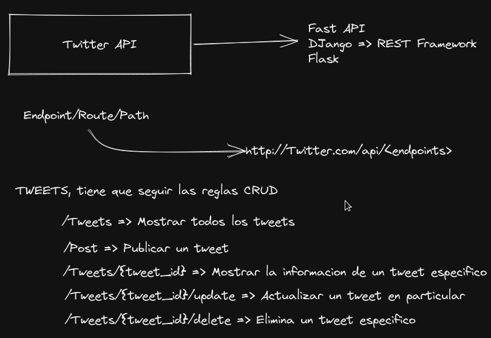
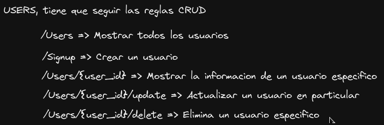

# Curso introduccion al Desarrollo Backend
La mayoria de aplicaciones nacen en la Web las cuales con el tiempo pasan a ser aplicaciones moviles, de escritorio incluso en un smartwatch.
En este Curso se aprenderan las bases para desarrollar una aplicacion Web.

## Ying y Yang de una Aplicacion: Frontend y Backend
Cuando una persona piensa en un automovil existen muchos componentes, pero existen dos componentes que son importantes:
- **Carroceria:** Lo que se ve de manera vistosa en el automovil.
- **Motor:** Lo que hace que funcione el automovil.

Las aplicaciones al final del dia son como un automovil, pues tienen una cara visible que es la carroceria y una logica que es el motor que hace que funcione la aplicacion. La analogia seria la siguiente:
- **Carroceria:** Frontend.
- **Motor:** Backend.

El frontend tiene principalmente las siguientes tecnologias:
- HTML
- CSS
    - Frameworks populares: Foundation, Bootstrap, Tailwind
- JavaScript
    - Librerias/Frameworks: ReactJS, Abgular, Svelte, Vue

Existe una etapa de disenio donde se realiza un concepto de como funcionara la aplicacion, para realizar el diseno se tiene dos areas importantes:
- UI Design: Diseno de la interfaz de usuario, se pueden utilizar herramientas como Adobe XD, Sketch o Figma
- UX Design: Diseno de experiencia de usuario.

El backend es la logica de la aplicacion, se pueden utilizar los siguientes lenguajes con sus derivados:
- JavaScript
    - NodeJS + Next
- PHP
    - Laravel
- Java
    - Spring
- Go
- Rust
- Ruby
    - Ruby on Rails
- Python
    - Fast API
    - Flask
    - DJango
## Framework vs. Libreria
Para empezar a construir el motor del auto es necesario tener muchas piezas por lo que es necesario tener diferentes materiales pues se esta intentando reinventar la rueda, pues existe codigos que ya existen que realiza cierta logica, a esto se le llama libreria. Se necesita tener un marco de trabajo para tener un motor especifico, es cdecir tener reglas para saber que motor especifico se realizara a esto se le llama framework.
## Como se conecta el forntend con el backend
El frontend tiene que unirse de alguna manera con el backend esta union se realiza con una API (Application Program Interface).

Esta es una seccion del backend que permite que el frontend pueda comunicarse con el backend, que existan mensajes de ida y de vuelta, existen dos grandes estandares para construir una API:
- ***SOAP:*** Simple Object Access Protocol, utiliza un lenguaje llamado XML (Extensible Markup Language) es muy parecido a HTML.
- ***REST:*** Representational State Transfer, este utiliza JSON (Javascript Object Notation)
## El lenguaje que habla Internet: HTTP
Significa **H**yper**t**ext **T**ransfer **P**rotocol. Existe un modelo donde se tiene un cliente que puede ser una computadora o dispositivo movil y se conecta al servidos donde se encuentra la aplicacion, basicamente se esta realizando una peticion al servidor el cual da una respuesta.

En HTTP se lo conoce como Request y Response, es un protocolo que sigue unas ciertas reglas para la comunicacion.

Cada request tiene diferentes tipos de cabeceras, cada cabecera (headers) tiene una informacion especifica, las respuestas por lo general tambien tienen un body el cual es el contenido de la respuesta que puede ser la aplicacion.
## Como es el flujo de desarrollo de una aplicacion web?
Lo primero que se realiza es empezar a codificar el codigo en un editor como VSCode, utilizando un control de versiones como git y se realizan pruebas en un navegador web de la compuytadora.

Para que la aplicacion cumpla su funcion pues se coloca el codigo en un servidor, por lo general el paso del entorno local a produccion (servidor) se lo conoce como deploy.

Por lo general se hace un push del codigo a un servicio como GitHub para ser compartido con el equipo de desarrollo, desde GitHub se realiza un CI/CD Continous Integration/Continues Deployment. En esta etapa se realiza un testeo antes de pasarlo al servidor de produccion.

El servidor guarda la aplicacion en un dominio, el dominio se compra de un servicio de dominios.

El entorno local esta formado por la direccion IP/Puerto 127.0.0.1:8000 ambos son denominados localhost.

## El hogar de tu codigo: El servidor
Un servidor es una compujtadora que continene una aplicacion yla distribuye por internet, se accede por el protocolo HTTP a traves del navegador Web.

Se encuentran en lugares llamados datacenters, es un inmenso lugar que se reunen una gran cantidad de servidores.
Los servidores pueden ser:
- **IaaS:** Infrastructure as a service, se puede controlar el CPU, RAM, SSD. Las opciones mas populares son AWS, Microsoft Azure, Digital Ocean (El mas barato). Se encuentran dos tipos:
    - Shared Hosting, se comparte recursos de un servidor con otras personas.
    - VPS, Virtual Private Server, es un servidor completamente privado.
- **PaaS:** Platform as a service, en esta opcion el servicio se encarga de actualizar los diferentes componentes que utiliza tu aplicacion como ser bases de datos y/o librerias, se tiene una interfaz grafica indicando que es lo que necesita una aplicacion, solo es para deployar el codigo sin tener en cuenta los recursos del servidor, se puede utilizar Google App Engine, Firebase, Heroku.
- **SaaS**: Software as a service, es cuando solo se necesita un software que ya esta publicado el cual utiliza tu aplicacion, rara vez se realiza codigo, ejemplo de esto es Google Docs, Slack, WordPress.

## Proyecto: Disenio y bosquejo de una API
El proyecto se basara en Twitter, lo mas importante en esta red social es publicar un mensaje y los usuarios pueden ver los mensajes de los usuarios que siguen.
Por lo que es importante:
- Crear usuarios.
- Crear tweets.
- Actualizar Usuario.
- Actualizar tweets.
- Borrar usuario.
- Borrar tweet.
- Borrar cuenta.
- Ver usuarios.
- Ver tweets.

El disenio de los tweets seria el siguiente:

El disenio de los usuarios seria el siguiente:

## Que lenguaje y framework escoger para backend
Se puede utilizar el siguiente lenguaje:
- Python
    - Django, Es el mas robusto con una gran comunidad y documentacion.
    - Flask, Curva de aprendizaje muy corta y es muy simple para proyectos personales.
    - Fast API, Framework mas rapido tanto en el desarrollo como en el desempenio.

- JavaScript
    - Express, Simple parecido a flask
    - Nest, es mas robusto parecido a express pero con esteroides.

- PHP
    - Laravel, Es el mas sencillo con una sitaxis mas simple.
    - Symfony, Un poco mas complicada pero con gran facilidad para escalarlo.

- Java
    - Spring

- Go
    - Gin, mas popularidad
    - Beego, esta en crecimiento

- Ruby
    - Rails